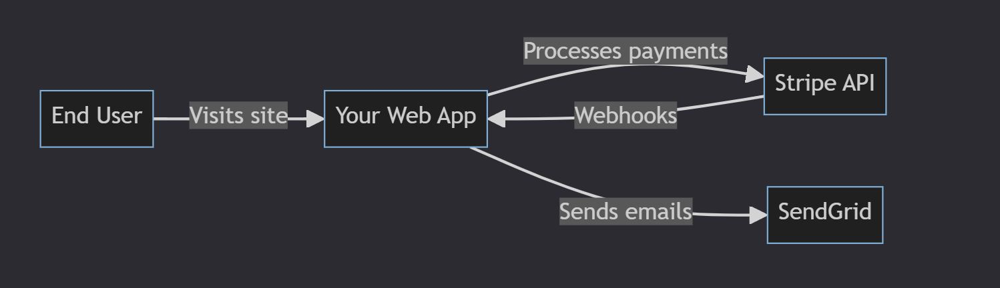
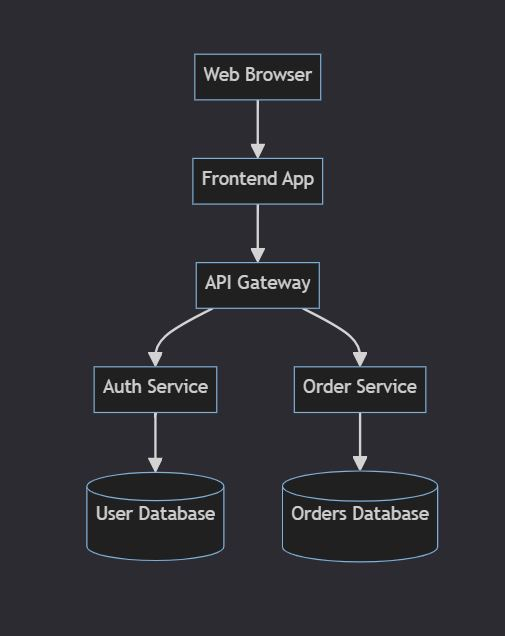

## System Architecture Documentation Best Practices and Tools

- **Show the System from Different Angles**

    **A. Conceptual View (PM/UX/business folks)**

    - What the system does for the user.

    - Example: “User Authentication System,” “Checkout Service”

    - Focus on user value and business goals.
    
    - **System Context Diagram:** Shows the system and its external dependencies. UX/PM/IT staff can see how it touches users and other systems.
     

    **B. Component View (frontend developers/IT staff)**

    - How the parts interact.

    - Example: “Web App calls API Gateway → Microservice → Database”

    - Focus on data flow and system boundaries.
    
    - **Container Diagram:** Shows main boundaries like “Web App,” “Auth API,” “Database.” Frontend and backend teams benefit.
    

    **C. Operational View (backend/DevOps)**

    - Where the system runs and how.

    - Example: servers, databases, cloud setup, scaling.

    - Focus on infrastructure and deployment.

    - **UML/Component Diagram:** Shows internal structure or interactions. Mostly backend focus, but helps everyone understand flow.

- **Translate Tech Into User-Relevant Outcomes**

    | Requirement | ❌ Technical Jargon | ✅ User Outcome |
    |---|---|---|
    | Scalability | Kubernetes for container orchestration | Can handle 10x daily users without slowdowns. |
    | Performance | CDN + caching | Pages load in under 500ms, no "loading" screens. |
    | Security | TLS 1.3 for data transfer | User data is safe; only authorized systems access PII (Personally Identifiable Information). |

