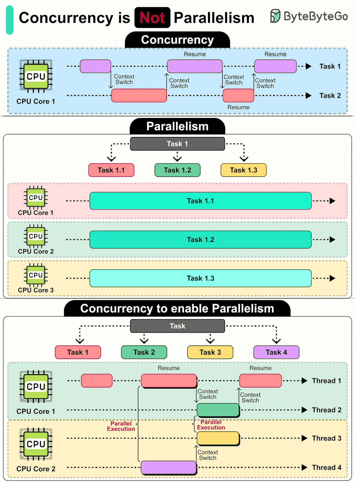

## concurrency vs parallelism

- **Concurrency:** managing multiple tasks at the same time in single CPU core.

- **Paralleism:** simultaneous execution of multiple tasks, using multiple CPU cores.

