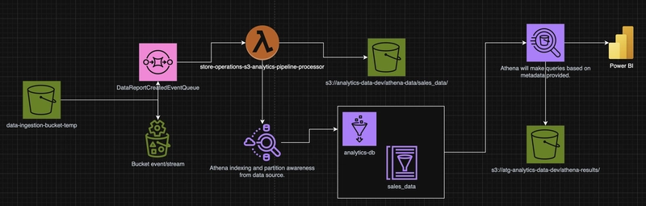

## Skip the Database: Dashboards Directly from S3 Files

**Problem:** CSV files are being deposited into an S3 bucket at regular intervals, which creates a steady stream of data that needs to be accessible for analysis and reporting. These files are pre-structured with well-defined schemas and cleaned/sanitized data.

```
CSV Files (Regular Intervals) → S3 Bucket Storage
    ↓
Well-structured + Pre-sanitized Data
    ↓
Single Entity (No Relational Dependencies)
    ↓
Ready for Processing (SQL)
```

**Solution**

```
┌─────────────┐    ┌─────────────┐    ┌─────────────┐    ┌─────────────┐
│   CSV File  │───▶│  S3 Bucket  │───▶│ S3 Event    │───▶│ SQS Queue   │
└─────────────┘    └─────────────┘    └─────────────┘    └─────────────┘
                                                      │
┌─────────────┐    ┌─────────────┐    ┌─────────────┐    ┌─────────┴───┐
│  Power BI   │◀───│   Athena    │◀───│ Glue Catalog│◀───│   Lambda    │
└─────────────┘    └─────────────┘    └─────────────┘    └─────────────┘
```

| Component | Purpose | Role |
|-----------|---------|------------------|
| S3 | Primary data storage | Houses original CSV files and partitioned data |
| SQS | Event queue | Buffers S3 file creation events for processing |
| Lambda | Event processor | Reads files, creates partitions, updates Glue catalog |
| Glue | Data catalog | Maintains schema and partition metadata for Athena |
| Athena | Query engine | Provides SQL interface for Power BI connectivity |



**Performance**

- **Query Caching** - Athena automatically caches results for repeated queries
- **Partition Pruning** - Only scans relevant data partitions, dramatically reducing query costs
- **Columnar Optimization** - Can easily migrate to Parquet format later for even better performance

## Implementation 

- **Core Schema Design (Critical Prerequisite)**
```
// Example filename: sales_data_2024_03_15.csv
// Partition extraction: year=2024, month=03, day=15

const filename = "sales_data_2024_03_15.csv";
const partitionPattern = /sales_data_(\d{4})_(\d{2})_(\d{2})\.csv/;
const [, year, month, day] = filename.match(partitionPattern);
```
- **Shared Configuration Structure**
```
// shared-config.json
{
  "aws": {
    "region": "us-east-1",
    "account_id": "${AWS_ACCOUNT_ID}"
  },
  "resources": {
    "source_bucket": "my-company-data-source",
    "analytics_bucket": "my-company-analytics",
    "glue_database": "analytics_db",
    "workgroup_name": "analytics_workgroup",
    "sqs_queue": "file_processing_queue"
  },
  "entities": {
    "sales": {
      "table_name": "sales_data",
      "filename_pattern": "sales_data_(\\d{4})_(\\d{2})_(\\d{2})\\.csv",
      "partition_keys": ["year", "month", "day"],
      "schema": [
        {"name": "transaction_id", "type": "string"},
        {"name": "customer_id", "type": "string"},
        {"name": "amount", "type": "decimal(10,2)"},
        {"name": "transaction_date", "type": "date"}
      ]
    }
  }
}
```
- **Core Lambda Logic**
```
// lambda/fileProcessor.ts
import { SQSEvent, SQSRecord } from 'aws-lambda';
import { S3, Glue, Athena } from 'aws-sdk';

export const handler = async (event: SQSEvent) => {
  for (const record of event.Records) {
    await processS3File(record);
  }
};

async function processS3File(sqsRecord: SQSRecord) {
  // 1. Extract S3 event from SQS message
  const s3Event = JSON.parse(sqsRecord.body);
  const bucket = s3Event.Records[0].s3.bucket.name;
  const key = s3Event.Records[0].s3.object.key;

  // 2. Get entity configuration
  const entityConfig = getEntityFromFilename(key);

  // 3. Extract partition information
  const partitions = extractPartitions(key, entityConfig.filename_pattern);

  // 4. Read and validate file
  const fileContent = await s3.getObject({ Bucket: bucket, Key: key }).promise();

  // 5. Create partitioned path
  const partitionedPath = buildPartitionPath(entityConfig, partitions);

  // 6. Write to analytics bucket
  await s3.putObject({
    Bucket: config.resources.analytics_bucket,
    Key: partitionedPath,
    Body: fileContent.Body
  }).promise();

  // 7. Update Glue catalog
  await updateGlueCatalog(entityConfig, partitions, partitionedPath);

  // 8. Optional: Validate with Athena query
  await validateCatalogUpdate(entityConfig.table_name, partitions);
}
```
- **Partition Management**
```
function buildPartitionPath(entityConfig: any, partitions: any): string {
  // Example: sales_data/year=2024/month=03/day=15/sales_data_2024_03_15.csv
  const partitionPath = entityConfig.partition_keys
    .map(key => `${key}=${partitions[key]}`)
    .join('/');

  return `${entityConfig.table_name}/${partitionPath}/${originalFilename}`;
}

async function updateGlueCatalog(entityConfig: any, partitions: any, s3Path: string) {
  const glue = new AWS.Glue();

  await glue.createPartition({
    DatabaseName: config.resources.glue_database,
    TableName: entityConfig.table_name,
    PartitionInput: {
      Values: entityConfig.partition_keys.map(key => partitions[key]),
      StorageDescriptor: {
        Location: `s3://${config.resources.analytics_bucket}/${s3Path}`,
        InputFormat: 'org.apache.hadoop.mapred.TextInputFormat',
        OutputFormat: 'org.apache.hadoop.hive.ql.io.HiveIgnoreKeyTextOutputFormat',
        SerdeInfo: {
          SerializationLibrary: 'org.apache.hadoop.hive.serde2.lazy.LazySimpleSerDe'
        }
      }
    }
  }).promise();
}
```