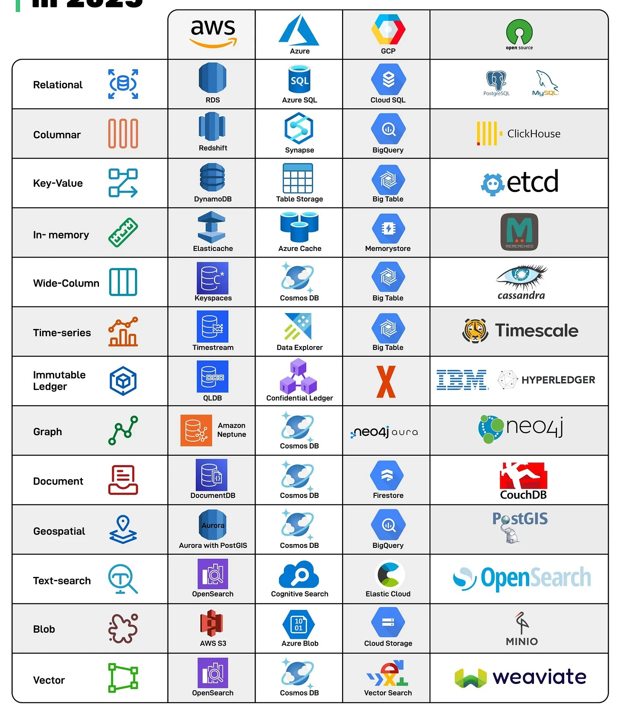

## Database Types
There’s no such thing as a one-size-fits-all database anymore. Modern applications rely on multiple database types, from real-time analytics to vector search for AI.

- **Relational:** Traditional row-and-column databases, great for structured data and transactions.

- **Columnar:** Optimized for analytics, storing data by columns for fast aggregations.

- **Key-Value:** Stores data as simple key–value pairs, enabling fast lookups.

- **In-memory:** Stores data in RAM for ultra-low latency lookups, ideal for caching or session management.

- **Wide-Column:** Handles massive amounts of semi-structured data across distributed nodes.

- **Time-series:** Specialized for metrics, logs, and sensor data with time as a primary dimension.

- **Immutable Ledger:** Ensures tamper-proof, cryptographically verifiable transaction logs.

- **Graph:** Models complex relationships, perfect for social networks and fraud detection

- **Document:** Flexible JSON-like storage, great for modern apps with evolving schemas.

- **Geospatial:** Manages location-aware data such as maps, routes, and spatial queries.

- **Text-search:** Full-text indexing and search with ranking, filters, and analytics.

- **Blob:** Stores unstructured objects like images, videos, and files.

- **Vector:** Powers AI/ML apps by enabling similarity search across embeddings.