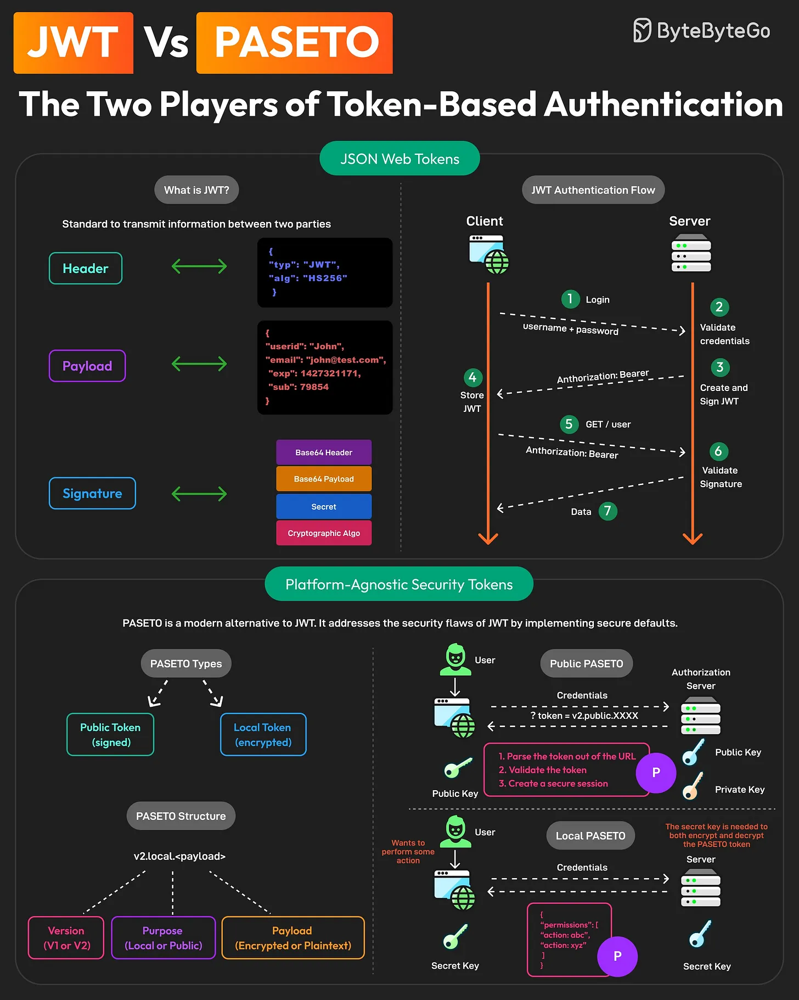

## JWT vs PASETO: The Two Players of Token-Based Authentication

1. **JWT**
A JWT consists of a Header, Payload, and Signature.

JWTs can be used to implement stateless authentication between client and server applications.

2. **PASETO**
Unlike JWT, PASETO enforces strong, cryptographically sound algorithms, reducing the risk of vulnerabilities.

A PASETO typically consists of Version, Purpose, and Payload. There are two types of PASETO:

- **Public PASETO:** They are signed using asymmetric cryptography and ensure the integrity of the data, but not its confidentiality.

- **Local PASETO:** They are encrypted using symmetric encryption algorithms, ensuring the confidentiality of the data contained within the token.

