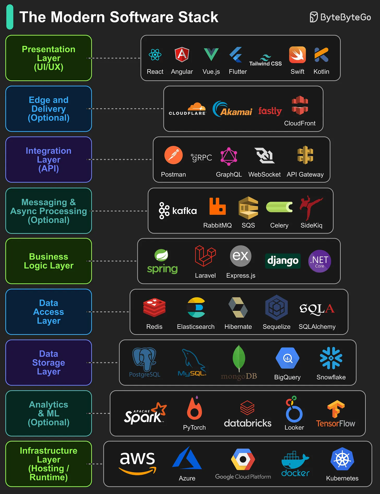

## The Modern Software Stack

9 layers that make up most modern applications:

1. **Presentation Layer (UI/UX):** Handles how users interact with the application, focusing on visuals, layout, and usability.

2. **Edge and Delivery (Optional):** Brings content closer to users through global delivery networks, reducing latency and improving performance.

3. **Integration Layer (API):** Defines how different parts of the system communicate, enabling interoperability between components.

4. **Messaging & Async Processing (Optional):** Processes tasks and events in the background to improve scalability and responsiveness.

5. **Business Logic Layer:** Implements the core rules, workflows, and decision-making processes of the application.

6. **Data Access Layer:** Acts as a bridge between application logic and stored data, ensuring secure and efficient retrieval or updates.

7. **Data Storage Layer:** Stores, organizes, and manages the application’s structured and unstructured data.

8. **Analytics & ML (Optional):** Analyzes data to generate insights, predictions, and intelligent features.

9. **Infrastructure Layer (Hosting / Runtime):** Provides the computing environment and resources for deploying, running, and scaling the application.
