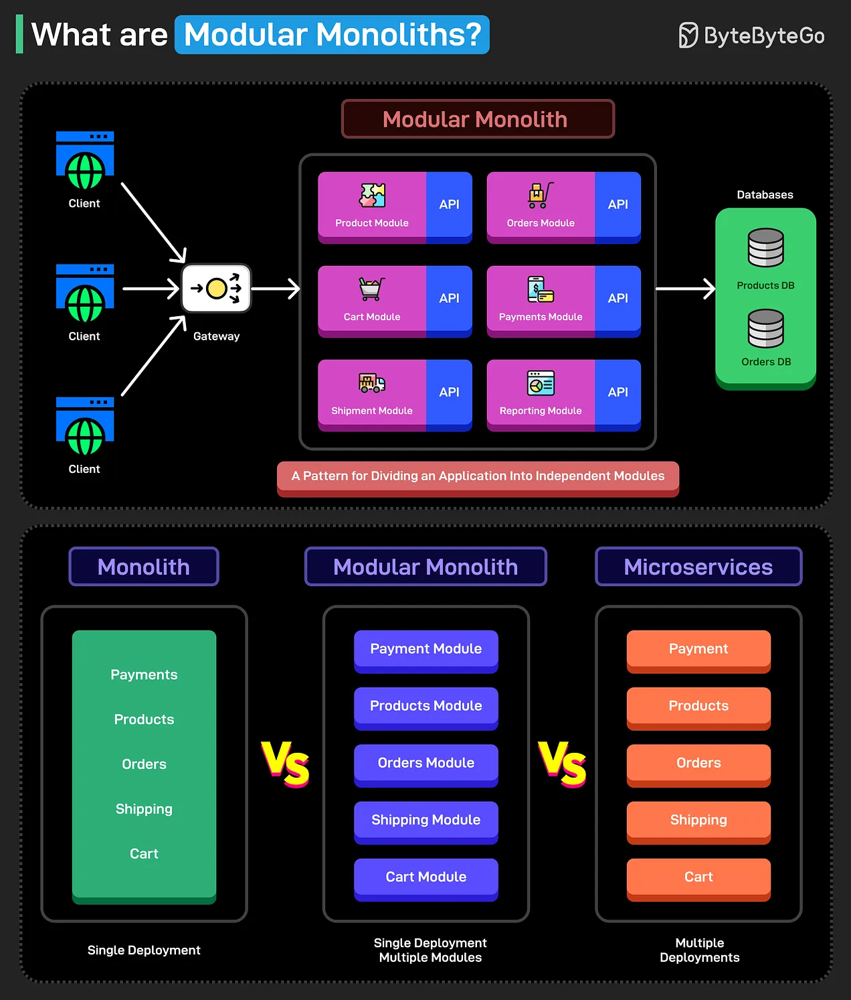

**What is Monolithic Architecture?**

A monolithic architecture is a traditional software design approach in which all application components—UI, business logic, and database access—are bundled into a single deployable unit. While monoliths are initially simple to develop and deploy, they often become difficult to scale and maintain as the project's complexity grows.



**Example structure:**
For an e-commerce platform, a modular monolith might have the following modules:

- **Orders Module** - Handles order processing.

- **Payments Module** - Processes transactions.

- **Inventory Module** - Tracks stock availability.
```
src/
|--orders
|    |--domain
|    |--application
|    |--infrastructure
|    |--api
|--inventory
|    |--domain
|    |--application
|    |--infrastructure
|    |--api
|--payments
|    |--domain
|    |--application
|    |--infrastructure
|    |--api
```
**Benefits**

- **Simplicity** – Easier to develop, test, and deploy compared to distributed architectures.

- **Performance** – No inter-service network calls, reducing latency.

- **Costs** - Lower operational complexity and infrastructure costs.

- **Consistency** – A single database ensures strong consistency without distributed transactions.

- **Maintainability** – Modular structure prevents the codebase from becoming an unmanageable monolith.

- **Flexibility** – Can evolve into microservices gradually if needed.

**Drawbacks**
- **Single deployment unit** – A single bug or failure can impact the system.

- **Scaling limitations** – While modular, it still runs as a single process, limiting the independent scaling of modules.

- **Growing complexity** – Without discipline, modular monoliths can degrade into tightly coupled systems over time.

- **Tech stack limitations** - Technology stack decisions affect the entire application.

**When to move to microservices?**

Despite its benefits, a modular monolith may eventually face limitations.

-  Businesses should consider transitioning to microservices **when independent scaling becomes necessary**, allowing different system parts to scale separately.

-  **Deployment flexibility** is another reason to migrate, as microservices enable teams to release updates independently.

-  **Microservices can benefit large development teams working on the same codebase** by reducing merge conflicts and increasing development speed. 

-  Companies needing **high availability and fault isolation** may also prefer microservices to prevent a failure in one service from affecting the entire system.

-  **Regulatory and compliance needs** may further push organizations toward microservices.

Transitioning should be incremental—starting with high-impact modules that most benefit from decoupling.


