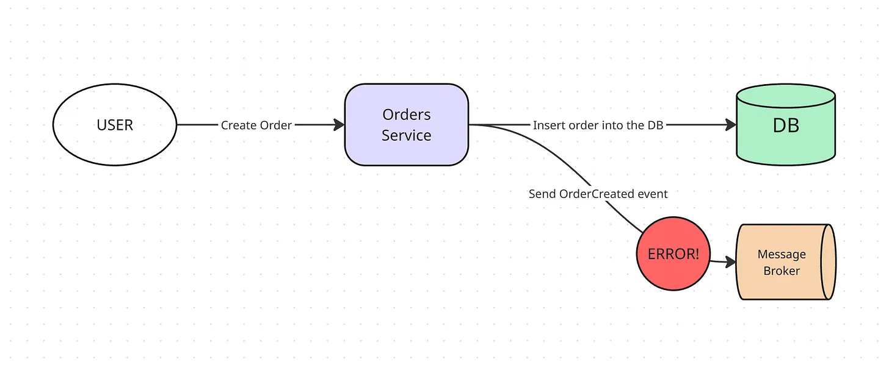
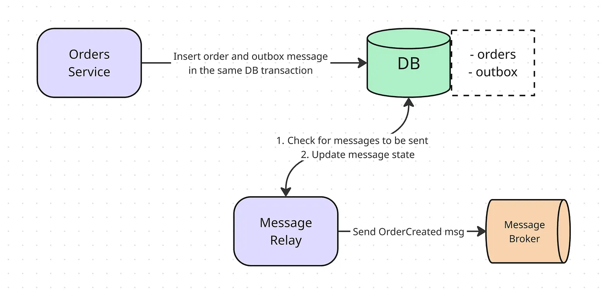
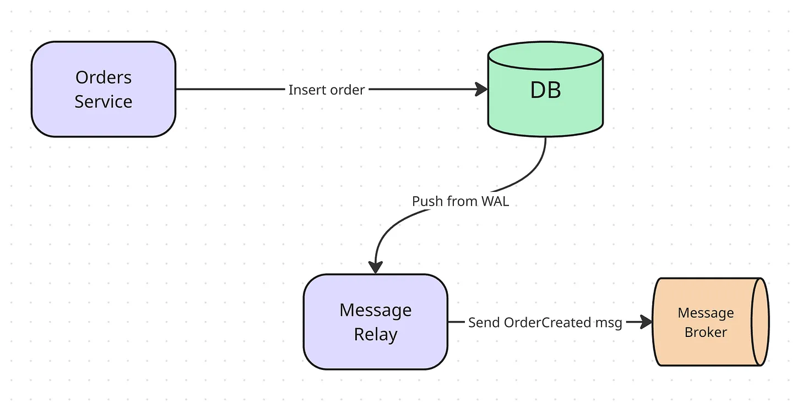

# outbox pattern

**problem:** 

what happens if the database commit succeeds, but the subsequent call to the message broker fails? Maybe the broker is temporarily down, or there's a network glitch. Or what if the database is not available at that time? Or what if the program somehow crashes?



You end up in an inconsistent state. Your local database has the new data, but the rest of the system never gets the notification. This is a serious issue because the database operation and the message publishing are not atomic - they don't succeed or fail as a single, indivisible unit.

**outbox pattern**

This is where the Outbox pattern comes to the rescue! 
Idea: instead of directly publishing a message to the broker, save the message to a dedicated "outbox" table within your local database as part of the same database transaction.



This approach guarantee that either both the business data is saved and the event is queued for sending, or neither is. The message can't get lost.

**Eexample schem for outbox table**
```
CREATE TABLE outbox (
    id uuid PRIMARY KEY,
    topic varchar(255) NOT NULL,
    message jsonb NOT NULL,
    state varchar(50) NOT NULL DEFAULT 'pending', -- e.g., pending, processed
    created_at timestamptz NOT NULL DEFAULT now(),
    processed_at timestamptz
);
```
**message relay**

Just putting messages in a database table doesn't send them, need a separate background process, a Message Dispatcher or Relay. This worker's job is to:

- Periodically query the outbox table for new, unprocessed messages.

- Publish these messages to the actual message broker.

- Once the broker confirms receipt, update the message's record in the outbox table to mark it as processed.

- Handle errors and retries.

Message consumers should always be designed to be **idempotent**, to safely process the same message multiple times without causing issues.

**alternative: Postgres logical replication(push)**

Databases like Postgres maintain a Write-Ahead Log (WAL), we can use this to impliment outbox. Instead of relay worker constantly asking the database "Anything new?"


